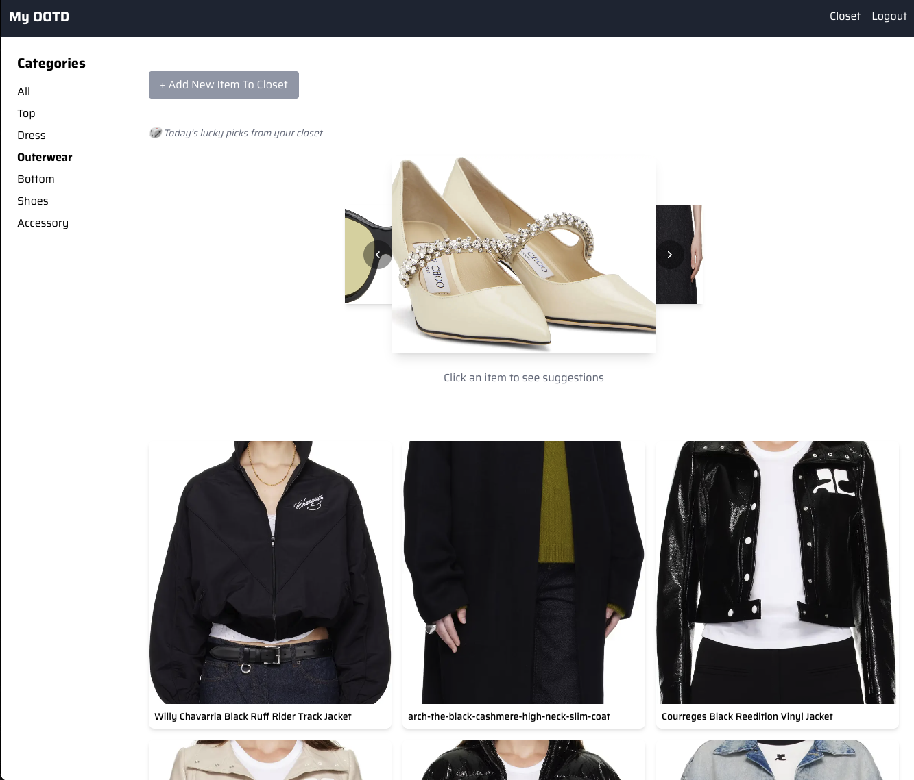
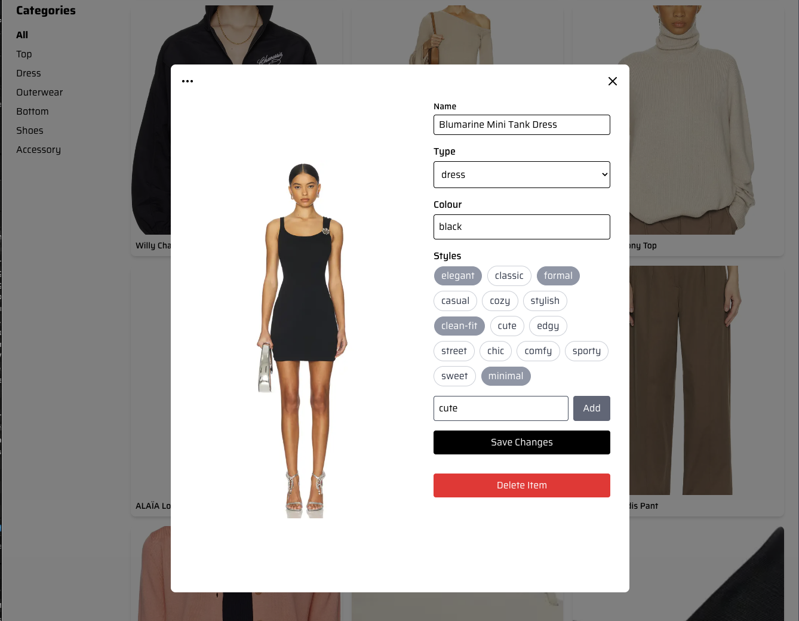
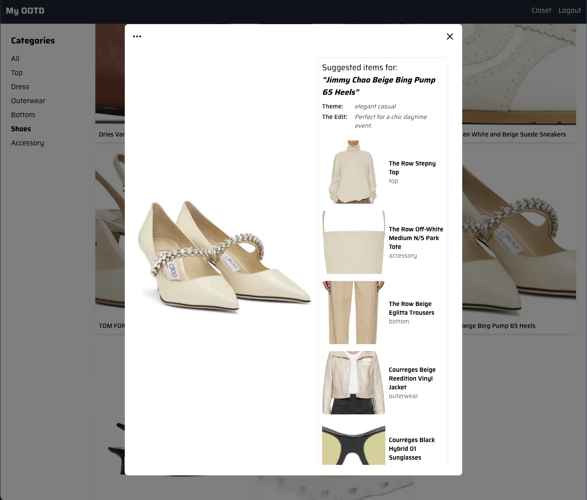

# My OOTD (Outfit of the Day)

A full-stack wardrobe management application that helps users organize their clothing and get AI-powered outfit suggestions based on their personal inventory.

## 🚀 Live Demo

Check out the live application here: **[My OOTD Demo](https://my-ootd.vercel.app/login)**

For a quick tour, the login fields are **pre-filled with a shared demo account**. Just click the login button to start exploring!

## 📌 Key Features

- **User Authentication:** Secure sign up and login with robust JWT authentication\*\*, refresh tokens, and session management
- **Digital Closet:** Easily add, edit, and organize all your clothes, tagging them by color, type, and custom **style tags** _(i.e. clean-fit, edgy etc.)_
- **AI Outfit Set Suggestions:** Get personalized outfit recommendations when you select an item _(e.g., pick a top and receive suggestions for bottoms, shoes and accessories)_ powered by a unique **two-stage AI pipeline**
- **Lucky Inspiration:** The "Lucky Items of the Day" feature helps you discover random, fun outfit ideas from your existing wardrobe

 

## 📷 Screenshots

|                               **Digital Closet View**                                |                                   **Item Tagging & Editing**                                   |
| :----------------------------------------------------------------------------------: | :--------------------------------------------------------------------------------------------: |
|  |             |
|                               **AI Outfit Suggestion**                               |                                  **Random Daily Inspiration**                                  |
|          |  |

## 📌 Tech Stack

| Category       | Technology                                                                  | Details                                                                           |
| :------------- | :-------------------------------------------------------------------------- | :-------------------------------------------------------------------------------- |
| **Frontend**   | **Next.js** (TypeScript), **React**, **Tailwind CSS**                       | Hosted on **Vercel** for fast performance.                                        |
| **Backend**    | **Flask** (Python), **Supabase** (PostgreSQL)                               | Backend running on **Render**. Supabase handles the database and cron jobs.       |
| **AI / ML**    | **Hugging Face Inference API**, **OpenRouter (NVIDIA Nemotron-Nano-9B-V2)** | Used for embedding generation, similarity matching, and contextual outfit advice. |
| **Deployment** | **Vercel** & **Render**                                                     | Full deployment pipeline for both frontend and backend.                           |

## 👘 The AI Pipeline: How It Generates Your Outfit

The hardest part of this project was building an AI recommendation system that was both smart and fast, especially while using free cloud resources. Here's the **two-step pipeline** I built to make it work:

### 1. Fast Filtering with Embeddings

This stage quickly narrows down thousands of items to a relevant few.

- **Rule-Based Pre-Selection:** A simple logic layer determines compatible item categories _before_ the main processing. _(Ex: selecting a **Top** includes bottoms and shoes, while selecting a **Dress** automatically excludes top and bottom categories)_.
- **Semantic Matching:** The app finds the best complementary items by calculating the **cosine similarity** between their pre-generated embeddings.
- **Efficiency:** Embeddings for all user items are **calculated once and stored** in the database when an item is created or updated.
- **Smart Caching:** To prevent unnecessary and costly API calls, I implemented a **10-minute cache** for user embeddings, drastically improving speed when users browse many outfits at once.

### 2. Contextual Selection with an LLM

The top matches from the filtering stage are handed off to the AI for final selection and style advice.

- **LLM as a Stylist:** I use a **pretrained LLM** (e.g., NVIDIA Nemotron-Nano) via API, treating it as a reasoning engine.
- **Prompt Engineering:** I spent time **refining the prompts** that go to the LLM. This ensures the AI doesn't just pick random items, but selects a single, cohesive outfit and generates a helpful description based on the style tags.

## ✏️📓 My Deployment Journey & What I Fixed

The path to deployment was tricky due to memory limits, but solving these problems led to a much more robust product.

| The Problem             | What I Tried First (and Failed)                                                                                      | The Production Solution                                                                                                                                                                                            |
| :---------------------- | :------------------------------------------------------------------------------------------------------------------- | :----------------------------------------------------------------------------------------------------------------------------------------------------------------------------------------------------------------- |
| **Server Memory Limit** | Tried to load the **`sentence-transformers`** model directly onto the free **Render** server to generate embeddings. | **The Fix:** The model instantly exceeded the memory limit. I **migrated to the Hugging Face Inference API** to offload the heavy model calculation, keeping the backend stable and light.                         |
| **Too Many API Calls**  | Initially generated embeddings on-demand every time a user asked for a recommendation.                               | **The Fix:** This was inefficient. I implemented **pre-generation and caching logic** so that each item's embedding is calculated only once and stored for 10 minutes, saving on API usage and speeding up the UI. |

## 👔 Project Status

This project is currently in active development and serves as a demonstration of my full-stack skills for my portfolio! ☺️

## 📁 Future Improvements

- Implement proper password reset and email verification flows.
- Add **AI-powered image tagging** to automatically suggest color and style when a user uploads a new item.
- Generate a single **outfit composite image** for easy sharing.
